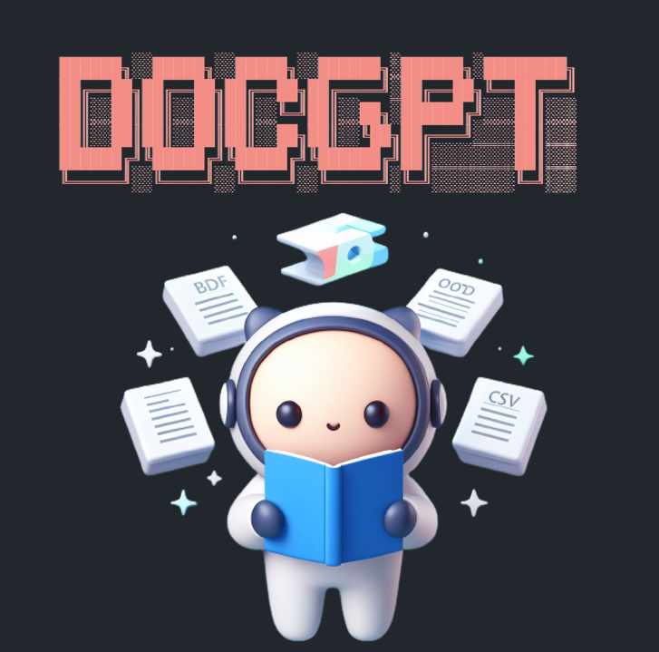

<p align="center">
    
</p>


[English](./README.md) | [中文版](./README.zh-TW.md)

Free `docGPT` allows you to chat with your documents (`.pdf`, `.docx`, `.csv`, `.txt`), without the need for any keys or fees.

Additionally, you can deploy the app anywhere based on the document.

- Table of Contents
    - [Introduction](#introduction)
    - [Features](#🧨features)
    - [What's LangChain?](#whats-langchain)
    - [How to Use docGPT?](#how-to-use-docgpt)
    - [How to Develop a docGPT with Streamlit?](#how-to-develop-a-docgpt-with-streamlit)
    - [Advanced - How to build a better model in langchain](#advanced---how-to-build-a-better-model-in-langchain)

* Main Development Software and Packages:
    * `Python 3.10.11`
    * `Langchain 0.0.218`
    * `Streamlit 1.22.0`
    * [more](./requirements.txt)

If you like this project, please give it a ⭐`Star` to support the developers~

### 📚Introduction

* Upload a Document link from your local device (`.pdf`, `.docx`, `.csv`, `.txt`) and query `docGPT` about the content of the Document. For example, you can ask GPT to summarize an article.

* Provide two models:
  * `gpt4free`
    * **Completely free, allowing users to use the application without the need for API keys or payments.**
    * Select the `Provider`. For more details about `gpt4free`, please refer to the [source project](https://github.com/xtekky/gpt4free).
  * `openai`
    * **Requires an `openai_api_key`, which you can obtain from [this link](https://platform.openai.com/).**
    * If you have an `serpapi_key`, AI responses can include Google search results.

<p align="center">

</p>

---

### 🧨Features

- **`gpt4free` Integration**: Everyone can use `docGPT` for **free** without needing an OpenAI API key.
- **Support docx, pdf, csv, txt file**: Users can upload PDF, Word, CSV, txt file.
- **Direct Document URL Input**: Users can input Document `URL` links for parsing without uploading document files(see the demo).
- **Langchain Agent**: Enables AI to answer current questions and achieve Google search-like functionality.
- **User-Friendly Environment**: Easy-to-use interface for simple operations.

---

### 🦜️What's LangChain?

* LangChain is a framework for developing applications powered by language models. It supports the following applications:
    1. Connecting LLM models with external data sources.
    2. Interactive communication with LLM models.

* For more details about LangChain, refer to the [official documentation](https://github.com/hwchase17/langchain).

**For questions that ChatGPT can't answer, turn to LangChain!**

LangChain fills in the gaps left by ChatGPT. Through the following example, you can understand the power of LangChain:

> In cases where ChatGPT can't solve mathematical problems or answer questions about events after 2020 (e.g., "Who is the president in 2023?"):
>
> * For mathematical problems: There's a math-LLM model dedicated to handling math queries.
> * For modern topics: You can use Google search.
>
> To create a comprehensive AI model, we need to combine "ChatGPT," "math-LLM," and "Google search" tools.
>
> In the non-AI era, we used `if...else...` to categorize user queries and had users select the question type through UI.
>
> In the AI era, users should be able to directly ask questions without preselecting the question type. With LangChain's agent:
>  * We provide tools to the agent, e.g., `tools = ['chatgpt', 'math-llm', 'google-search']`.
>  * Tools can include chains designed using LangChain, such as using a retrievalQA chain to answer questions from documents.
>  * **The agent automatically decides which tool to use based on user queries** (fully automated).

Through LangChain, you can create a universal AI model or tailor it for business applications.


---

### 🚩How to Use docGPT?

1. 🎬Visit the [application](https://docgpt-app.streamlit.app/).

2. 🔑Enter your `API_KEY` (optional in Version 3, as you can use the `gpt4free` free model):
   - `OpenAI API KEY`: Ensure you have available usage.
   - `SERPAPI API KEY`: Required if you want to query content not present in the Document.

3. 📁Upload a Document file (choose one method)
    * Method 1: Browse and upload your own `.pdf`, `.docx`, `.csv`, `.txt` file from your local machine.
    * Method 2: Enter the Document `URL` link directly.

4. 🚀Start asking questions!


---

### 🧠How to Develop a docGPT with Streamlit?

A step-by-step tutorial to quickly build your own chatGPT!

First, clone the repository using `git clone https://github.com/Lin-jun-xiang/docGPT-streamlit.git`.

There are few methods:

* **Local development without docker**:
    * Download the required packages for development.
        ```
        pip install -r requirements.txt
        ```

    * Start the service in the project's root directory.
        ```
        streamlit run ./app.py
        ```

    * Start exploring! You server will now be running at `http://localhost:8501`.

* **Local development with docker**:
    * Start the service using Docker Compose
        ```
        docker-compose up
        ```

        You server will now be running at `http://localhost:8501`. You can interact with the `docGPT` or run your tests as you would normally.
    
    * To stop the Docker containers, simply run:
        ```
        docker-compose down
        ```

* **Streamlit Community Cloud for free** deployment, management, and sharing of applications:
   - Place your application in a public GitHub repository (ensure you have `requirements.txt`).
   - Log in to [share.streamlit.io](https://share.streamlit.io/).
   - Click "Deploy an App," then paste your GitHub URL.
   - Complete deployment and share your [application](https://docgpt-app.streamlit.app//).

Due to the limitations of the free version of Streamlit Cloud and its reliance on server resources, `docGPT` may experience some latency. We recommend users to consider deploying it locally for a smoother experience

---

### 💬Advanced - How to build a better model in langchain

To build a powerful docGPT model in LangChain, consider these tips to enhance performance:

1. **Language Model**

    Select an appropriate LLM model, such as OpenAI's `gpt-3.5-turbo` or other models. Experiment with different models to find the best fit for your use case.

    ```python
    # ./docGPT/docGPT.py
    llm = ChatOpenAI(
    temperature=0.2,
    max_tokens=2000,
    model_name='gpt-3.5-turbo'
    )
    ```

    Please note that there is no best or worst model. You need to try multiple models to find the one that suits your use case the best. For more OpenAI models, please refer to the [documentation](https://platform.openai.com/docs/models).
    
    (Some models support up to 16,000 tokens!)

2. **PDF Loader**

    Choose a suitable PDF loader. Consider using `PyMuPDF` for fast text extraction and `PDFPlumber` for extracting text from tables.
    
    ([official Langchain documentation](https://python.langchain.com/docs/modules/data_connection/document_loaders/how_to/pdf))

    * `PyPDF`: Simple and easy to use.
    * `PyMuPDF`: Reads the document very **quickly** and provides additional metadata such as page numbers and document dates.
    * `PDFPlumber`: Can **extract text within tables**. Similar to PyMuPDF, it provides metadata but takes longer to parse.

    If your document contains multiple tables and important information is within those tables, it is recommended to try `PDFPlumber`, which may give you unexpected results!

    Please do not overlook this detail, as without correctly parsing the text from the document, even the most powerful LLM model would be useless!

3. **Tracking Token Usage**

    Implement token usage tracking with callbacks in LangChain to monitor token and API key usage during the QA chain process.

    When using `chain.run`, you can try using the [method](https://python.langchain.com/docs/modules/model_io/models/llms/how_to/token_usage_tracking) provided by Langchain to track token usage here:

    ```python
    from langchain.callbacks import get_openai_callback

    with get_openai_callback() as callback:
        response = self.qa_chain.run(query)

    print(callback)

    # Result of print
    """
    chain...
    ...
    > Finished chain.
    Total Tokens: 1506
    Prompt Tokens: 1350
    Completion Tokens: 156
    Total Cost (USD): $0.03012
    ```

<a href="#top">Back to top</a>
 